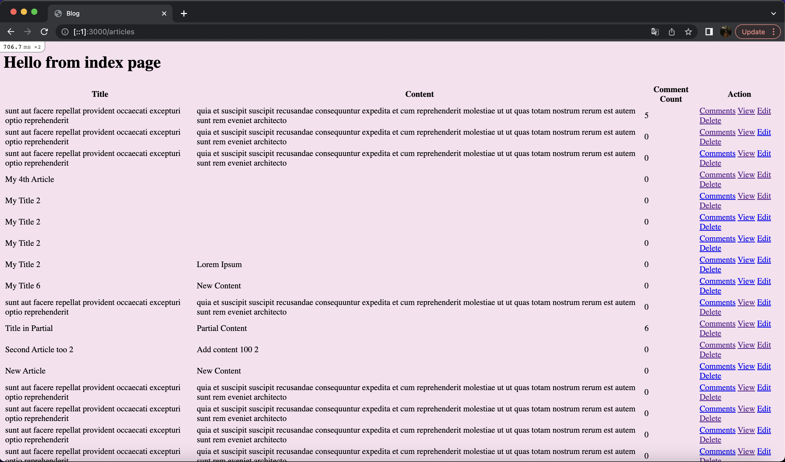

# README

# About the Project



This project is an integration of api wrappers and a pre-existing blog application, where I called data from apis to use in the application. The apis can either provide fake data to create new articles or comments, or provide a random color to change the background.

# Technologies

Project is created with:
- Ruby 2.7.4
- Rails 6.1.5

# API

- [JSONPlaceholder (posts)](https://jsonplaceholder.typicode.com/posts)
    - provides fake posts
- [JSONPlaceholder (comments)](https://jsonplaceholder.typicode.com/comments)
    - provides fake comments
- [Creative Handles](http://api.creativehandles.com/getRandomColor)
    - provides random color

# Getting Started

1. Clone repository

```
git clone https://github.com/patmln/blog_app.git
cd blog_app
```

2. Initialize database

```
rails db:create
rails db:migrate
```

3. Add gem in [Gemfile](Gemfile) and run bundle install


```ruby
gem 'rest-client'
```

```
bundle install
```

4. Deploy

```
rails s
```
